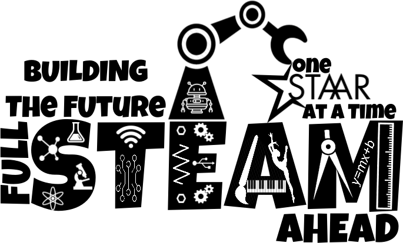
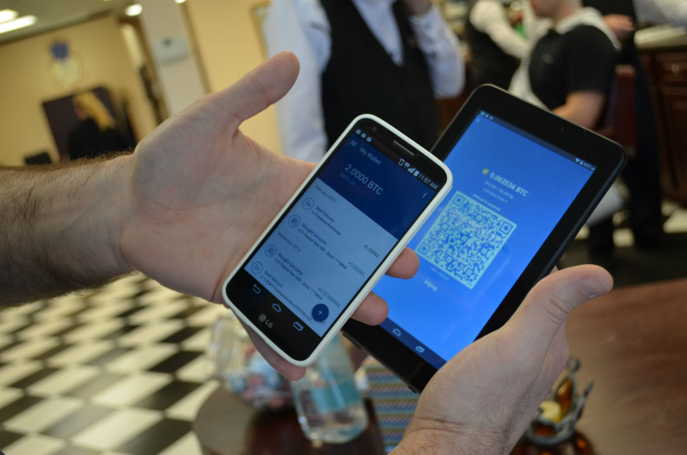

# Fake News - a Technological Approach to Proving Provenance Using Blockchains

by Steven Huckle - s.huckle@sussex.ac.uk

- - -

## Objectives

+ Provide an Overview of Blockchain Technology
+ Introduce Fake News and How Blockchains May Help Overcome the Issue
+ Demonstrate Blockchain Provenance

## Table of Contents

+ Me
+ Blockchain Overview
+ Fake News and [Provenator](https://github.com/glowkeeper/Provenator)
+ Summary

## Me - Steven Huckle

+ 25+ Years in IT
+ Trainee Cobol Programmer
+ BSc Computer Science
+ UNIX Sys' Admin'
+ MSc Music Technology

## Me (cont'd)

+ Audio Programmer in Games
+ Freelance Programmer
+ MSc Energy and the Environment
+ [Bitcoin](https://bitcoin.org/en/) Mining
+ PhD in Blockchain Technologies, here at the [University of Sussex](https://www.sussex.ac.uk/)

## Publications

+ [Fake News - a Technological Approach to Proving Provenance Using Blockchains](https://doi.org/10.1089/big.2017.0071)
+ [Towards a post-cash society: An application to convert fiat money into a cryptocurrency](http://dx.doi.org/10.5210/fm.v22i3.7410)
+ [Socialism and the Blockchain](http://dx.doi.org/10.3390/fi8040049)
+ [Internet of Things, Blockchain and Shared Economy Applications](http://dx.doi.org/10.1016/j.procs.2016.09.074)

# Technical Background

_Source: [Open Clip Art](https://openclipart.org/detail/271913/full-steam)_

- - -

## Key Technology

+ Cryptography
+ Distributed Computer Systems
+ Consensus

## Cryptography

The mathematics of information security.

+ **Public-key Cryptography (PKC)** - A form of encryption that creates a public key, which is shared, widely, and a private key, which is known only to the owner
+ **Cryptographic Hash Functions** - Maps arbitrary data to a unique fixed-size string
+ **Digital Signatures** - Identity authentication that allows users to digitally sign their messages

## Distributed Computer Systems

+ **P2P** - A network where its participants are both resource providers and resource requesters
+ **Decentralised**
	+ Architecturally
	 	+ Fault tolerance
		+ Attack resistance
		+ Collusion resistance
 	+ Politically - Control is not ceded to one individual or organisation
+ **Distributed** - A decentralised system that is logically centralised

## Consensus

Protocols that define how global agreement is reached in a distributed system. Thus, they address the _Byzantine Generals Problem_.

# Blockchains

_Source: [Bitnation](https://tinyurl.com/nktt7tx)_

- - -

## Blockchain's Key Features

+ **Data distribution** - A public asset ledger of propagated values, which are coalesced into blocks of transactions
+ **Distributed authority** - P2P decentralised network
+ **Use of cryptography** - Changes are tracked and write permissions are controlled by public key cryptography
+ **Programmability/automation** - e.g. smart contracts, of which [Provenator](https://github.com/glowkeeper/Provenator) takes advantage

## Blockchain's Key Features (cont'd)

**Data distribution** + **Distributed authority** + **Use of cryptography** + **Programmability/automation** = a system ideally suited for _trusted cooperation_; a key component of my thesis, which asks: _how are blockchains the means by which we may collaborate?_

# Bitcoin

_Source: Ariel Zambelich/Wired_

- - -

## Bitcoin Introduction

[Bitcoin](https://bitcoin.org/en/) was first introduced by Satoshi Nakamoto's white paper describing _a peer-to-peer electronic cash system_.

_"[Bitcoin](https://bitcoin.org/en/) is a **consensus network** that enables a new payment system and a completely **digital money**. It is the first decentralised **peer-to-peer payment network** that is powered by its users with **no central authority** or middlemen. From a user perspective, [Bitcoin](https://bitcoin.org/en/) is pretty much like **cash for the internet**. [Bitcoin](https://bitcoin.org/en/) can also be seen as the most prominent **triple entry bookkeeping system** in existence."_

_Bitcoin Website FAQ_

## The Problems Addressed by Bitcoin

+ [Bitcoin](https://bitcoin.org/en/) obfuscates much of modern money's trust mechanisms
+ Cryptographic proof removes the need for a third-parties to verify payments
+ Cryptography also ensures authenticity
+ Distributed consensus solves the problem of double spending
+ Trusted identity gives the system a natural way of overcoming 'Sybil Attacks'
+ Provides a solution to the _Byzantine Generals Problem_

## Bitcoin Overview

+ Referred to as _cryptocurrency_ because it is a form of electronic currency that relies on cryptographic techniques to prove identity and authenticity and to enforce read and write access to the [Bitcoin](https://bitcoin.org/en/) network.
+ The basic unit of account on the system is also called _Bitcoin_, and the smallest unit amount within the [Bitcoin](https://bitcoin.org/en/) network is the _Satoshi_.

## How does Bitcoin work?

> + [Bitcoin](https://bitcoin.org/en/) is a P2P network whose overriding purpose is the propagation of any _transactions_ requiring validation
> + _Miners_ on the network use computing power to solve computationally intensive cryptographic puzzles that verify _blocks_ of transactions
> + Transactions are owners of Satoshi transferring their ownership. New owners can authorises those transactions' ongoing transfer, forming a chain of ownership - a _blockchain_
> + Hence, paying with [Bitcoin](https://bitcoin.org/en/) means creating a record of a _transaction_
> + Thus, the _blockchain_ is a distributed, historical record of all [Bitcoin](https://bitcoin.org/en/) transactions

## Bitcoin Transactions

_Source: [Bitcoin: A Peer-to-Peer Electronic Cash System by Satoshi Nakamoto](https://bitcoin.org/bitcoin.pdf "Bitcoin White Paper")_

## Valid Blockchain Transactions

1. **Authorised**: They should be authorised so that only user x can perform transactions under the guise of user x
2. **Read-only and Final**: Transactions cannot be modified, nor deleted
4. **Uncensored**: The transaction should be added to the ledger, as long as it conforms to the blockchain's protocol
5. **Consistent**: They should conform to the present state of the system

## Blocks

Writing individual transactions to the blockchain would be inefficient. Hence, [Bitcoin](https://bitcoin.org/en/) packages many transactions into blocks, which are Merkle tree data structures.

_Source: [Bitcoin: A Peer-to-Peer Electronic Cash System by Satoshi Nakamoto](https://bitcoin.org/bitcoin.pdf "Bitcoin White Paper")_

## Bitcoin Mining

[Bitcoin](https://bitcoin.org/en/) validates blocks of transactions using _Proof of Work_ consensus. That's a scheme based on a _SHA-256_ hashing algorithm, which produces a hash with a value less than a difficulty target. It takes approximately ten minutes to calculating the hash, a process known as _mining_ because the network rewards the P2P node that successfully solves that problem with 'mined' [Bitcoin](https://bitcoin.org/en/). Hence, mining is also the process by which the system adds new coins to the network.

## Bitcoin Mining (cont'd)

The validation process produces a block that contains a _timestamp_, a _nonce_ and the root hash of a _Merkle Tree_ of all transactions for that block.

## Bitcoin Mining (cont'd)

Finally, the block is broadcast so that network nodes can decide on its validity.

_Source: bitcoin.org_

# Ethereum

_Source: https://twitter.com/ethereum_

- - -

## Ethereum Overview

Similar to [Bitcoin](https://bitcoin.org/en/), [Ethereum](https://www.ethereum.org/) is an open-source, public, blockchain-based system. It is technology that also enables smart contract exchange, a capability which is exploited  by my Fake News app', [Provenator](https://github.com/glowkeeper/Provenator).

## Smart Contracts

+ Algorithms that provide a secure mechanism for electronic collaboration which does not rely upon a central authority for trust
+ Helps automate a system’s rule set via autonomous scripts that can represent verifiable application logic

# Fake News

_Source: Birmingham Mail_

- - -

## Fake News Paper

My article, [Fake News - a Technological Approach to Proving Provenance Using Blockchains](https://doi.org/10.1089/big.2017.0071), describes a photo that a prominent supporter of Donald Trump claimed showed the Clinton Campaign doctoring votes. The New York Times went to great lengths to prove the picture was fake; I create a scenario where the paper is saved a lot of bother because the photographer uses my blockchain app', [Provenator](https://github.com/glowkeeper/Provenator), to establish the origins of her snap.

## Provenator

Demonstration of [Provenator](https://github.com/glowkeeper/Provenator).

- - -

# Wrapping Up

_Source: [Open Clipart](https://openclipart.org/detail/220024/parcel-bw)_

- - -

## Conclusions

> + Quick intro' to the key technology behind blockchains - Cryptography, distributed systems and consensus algorithms
> + Overview of blockchains - Data distribution, distributed authority, use of cryptography, programmability
> + Bitcoin - transactions, blocks, mining
> + Ethereum - Smart contracts

## Conclusions (cont'd)

> + Fake News reached a crescendo during the 2016 US Presidential Election
> + Introduced [Provenator](https://github.com/glowkeeper/Provenator), a prototype dApp for proving the origins of digital media
> + Conclusion - the trust mechanisms of blockchain technology can show the provenance of any source of digital media

## Future Work

## Appendix I

+ Watch, Star, Fork [https://github.com/glowkeeper/Provenator](https://github.com/glowkeeper/Provenator) (_please_)
+ Support open source! Open data! Open standards in general!

## Appendix II

This presentation is available at [https://github.com/glowkeeper/digitalDiscoveryPresentation](https://github.com/glowkeeper/digitalDiscoveryPresentation).

The presentation is just HTML5, so it runs in a browser, as though it's a traditional website. It was produced with 100% open source tools, including [Pandoc](https://pandoc.org/) and [reveal.js](https://github.com/hakimel/reveal.js/ "reveal.js"), as well as an open source markup language, [Markdown](https://daringfireball.net/projects/markdown/).

# Thank You

Steven Huckle - s.huckle@sussex.ac.uk - [https://glowkeeper.github.io](https://glowkeeper.github.io/)
