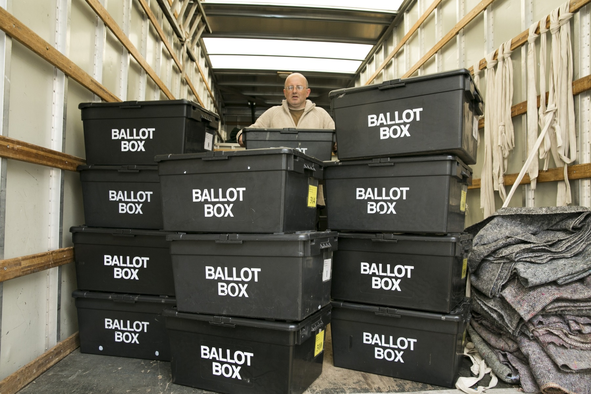

# Fake News - a Technological Approach to Proving Provenance Using Blockchains

_Source: Birmingham Mail

## Objectives

> + Provide an Overview of Blockchain Technology
> + Introduce My Fake News Paper
> + Demonstrate Blockchain Provenance

## Table of Contents

> + Blockchain Overview
> + Introduce Fake News Paper
> + Demonstrate Blockchain Provenance
> + Summarise the Use Case Demonstrated

# Blockchain Overview

blah

# Fake News

_Source: Birmingham Mail

## Fake News Paper

My article on Fake News describes a photo that a prominent supporter of Donald Trump claimed showed the Clinton Campaign doctoring votes. The New York Times went to great lengths to prove the picture was fake; I create a scenario where the paper is saved a lot of bother because the photographer uses my blockchain app' to establish the origins of her snap.

# Provenator

Demonstration...

# Summary

> + Fake News reached a crescendo during the 2016 US Presidential Election
> + Introduced [Provenator](https://github.com/glowkeeper/Provenator), a prototype dApp for proving the origins of digital media
> + Conclusion - the trust mechanisms of blockchain technology can show the provenance of any source of digital media

(Provenator is incapable of proving the authenticity of a news story as a whole. We believe that takes human skills)
